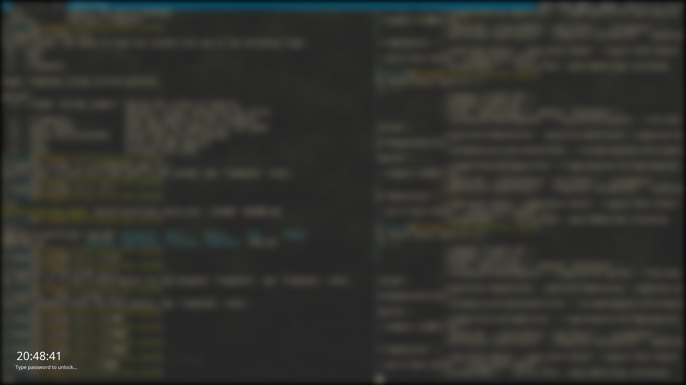

# betterlockscreen_rapid

This is a shell script wrapper for [i3lock-fancy-rapid][] inspired by [betterlockscreen][].

It takes a screenshot, blurs it and use it as your lockscreen. All this is done in a very short period of time.

Here is an example:



## Feature

- rapid
- good-looking
- configurable

## Installation

### Package Manager

#### Arch Linux

Install the aur package [betterlockscreen_rapid-git](https://aur.archlinux.org/packages/betterlockscreen_rapid-git).

#### Gentoo Linux

Thanks for [jian-lin](https://github.com/jian-lin)'s contribution.

Install the [GURU](https://wiki.gentoo.org/wiki/Project:GURU) package `x11-misc/betterlockscreen_rapid`. Please refer to [this](https://github.com/oakszyjrnrdy/betterlockscreen_rapid/issues/1#issue-771802017) for more information.

#### Others

If you want to package it for other distributions, please let me known and I'll put the package information here.

### Manual Installation

1. Install all the dependencies.
2. Copy `betterlockscreen_rapid` to `/usr/bin/` or somewhere else in you `$PATH`.
3. Copy `betterlockscreen_rapid.conf` to `/etc/`.

## Configuration

Make directory `$XDG_CONFIG_HOME/betterlockscreen_rapid/` and write your own configuration file `betterlockscreen_rapid.conf` there.

You can use `betterlockscreen_rapid.conf` as a reference. More information can be found at [betterlockscreen][].

Note that `$XDG_CONFIG_HOME` defaults to `$HOME/.config/`.

## Usage

```bash
betterlockscreen_rapid radius times
```

- `radius` is the kernel size of the box filter.
- `times` is the number of times we filter the image.

More information can be found at [i3lock-fancy-rapid][].

### Note

`betterlockscreen` defaults to `nofork` mode.

`nofork` mode may be benefical to you, e.g. you can pause you notificition before locking your screen and resume it after unlocking your screen like this:

```bash
dunstctl set-paused true
betterlockscreen_rapid 31 3
dunstctl set-paused false
```

If you do not want `nofork` mode, you can set `nofork='false'` in the [configuration](#configuration) to disable it.

## Dependency

- [i3lock-color][] >= 2.13.c.3
- [i3lock-fancy-rapid][]

## LICENSE

MIT

[i3lock-color]: https://github.com/Raymo111/i3lock-color
[i3lock-fancy-rapid]: https://github.com/yvbbrjdr/i3lock-fancy-rapid
[betterlockscreen]: https://github.com/pavanjadhaw/betterlockscreen
